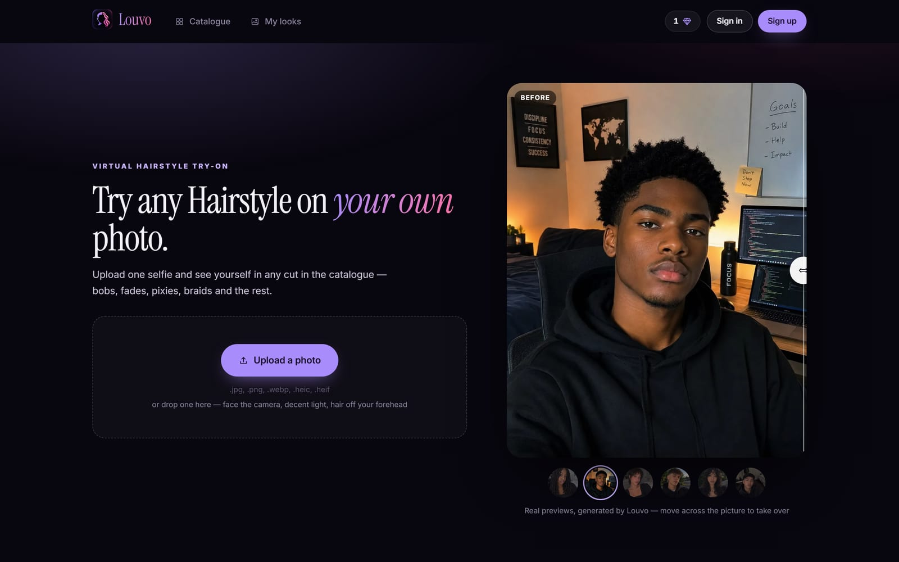
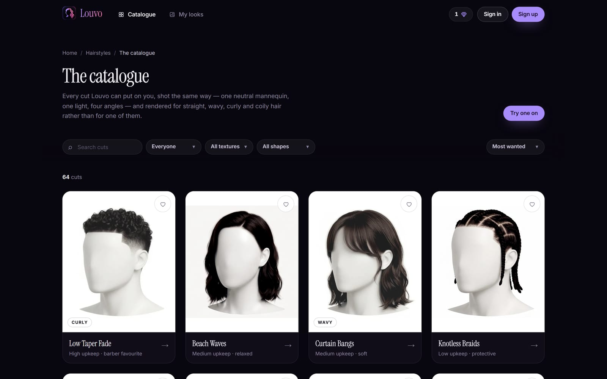
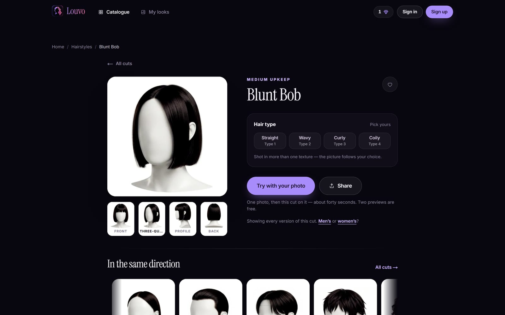
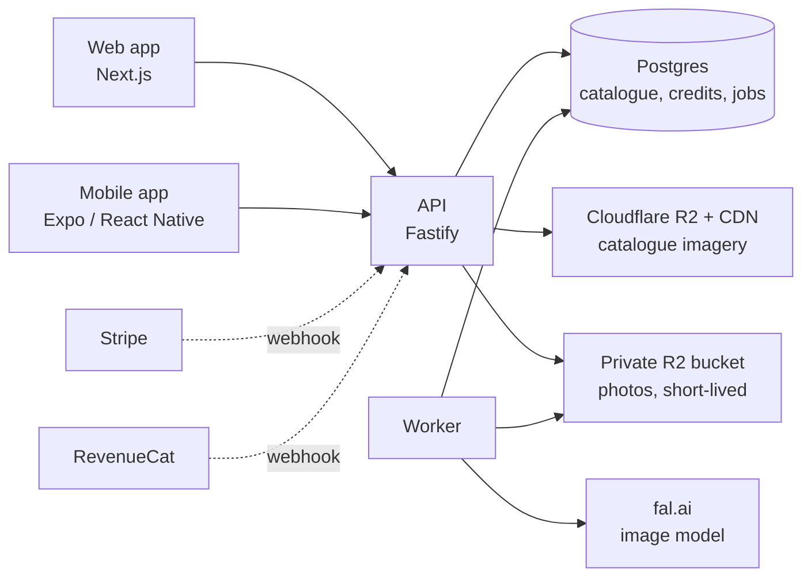

<div align="center">


# Louvo

**Try any hairstyle on your own photo before you sit in the chair.**

Upload one selfie, pick a cut from the catalogue, and an AI image model puts that exact haircut on you.

[**louvo.app**](https://www.louvo.app) · [Architecture](#how-it-works) · [Run it locally](#run-it-locally) · [Docs](#documentation)


</div>



## What it does

Asking an image model for "a buzz cut" gives you a different buzz cut every time, and never the one you picked.
Louvo solves that by showing the model the haircut instead of naming it. Every style in the catalogue is rendered
on the same faceless mannequin, and that render is sent alongside your photo as the reference.

- **A consistent catalogue.** 60+ cuts, each shot the same way: one neutral mannequin, one light, four angles,
  rendered for straight, wavy, curly and coily hair.
- **Previews of your own photo.** The model is told to change the hair to match the reference and leave everything else alone.
- **Background jobs.** A preview keeps running if you leave the page or close the app, and the phone app sends a push notification when it's ready.
- **Before / after compare.** A draggable wipe or side-by-side view, plus a library of saved looks and favourites.
- **Credits and payments.** Two free previews per device, then credit packs through Stripe on the web or
  the App Store / Google Play (via RevenueCat) on mobile. Balances live on the server and are refunded if a preview fails.
- **Sharing with referrals.** A shared look becomes a branded card with a link that opens the haircut
  on the web, or the app if it's installed.
- **Privacy by design.** Uploaded photos go to a private, short-lived bucket and are deleted once the preview is delivered.

<table>
  <tr>
    <td></td>
    <td></td>
  </tr>
  <tr>
    <td align="center"><sub>The catalogue: search and filter by gender, texture and shape</sub></td>
    <td align="center"><sub>A style page: four angles, pick your hair type, try it on</sub></td>
  </tr>
</table>

## How it works

One backend, two front ends. The website and the phone app talk to the same API.



- **The catalogue is data, not code.** Hairstyle metadata lives in Postgres and the renders are content-addressed WebP
  files on a CDN, so adding a haircut is `npm run catalog:publish`, not an app release.
- **Generation runs on the server.** The app submits a job, the photo is uploaded straight to a private bucket, a worker
  calls the model, and the result is handed back and deleted. The model key stays on the server.
- **Credits are transactional.** A credit is held when a job is submitted, spent when the preview lands and refunded
  when it doesn't. Purchases are credited only from Stripe and RevenueCat webhooks, never from what a client claims.

## Tech stack

| Area | Tools |
| --- | --- |
| Web | Next.js 16, React 19, Tailwind CSS, Clerk (sign-in) |
| Mobile | Expo SDK 57, React Native, Expo Router, Reanimated, RevenueCat |
| API | Node.js, Fastify, PostgreSQL, Stripe |
| Storage | Cloudflare R2 (public CDN bucket + private transient bucket) |
| AI | fal.ai image editing models |
| Hosting | Railway (API, worker and database) |
| Tooling | TypeScript everywhere, `pg-mem` in-memory sandbox, custom Node scripts for the render pipeline |

## Project structure

```
app/        Expo Router screens for the mobile app
src/        mobile app: API client, components, state, theme
web/        Next.js website (louvo.app)
server/     Fastify API, background worker, SQL migrations, publishing scripts
scripts/    catalogue render pipeline: mannequins, hair masks, app icons, try-on CLI
docs/       design write-ups for each part of the system
```

## Run it locally

You don't need any accounts or keys to try it. The sandbox runs the whole backend in memory.

```bash
npm install && npm --prefix server install && npm --prefix web install

npm run sandbox     # the full API in memory on :8099 (no database, no bucket, no fal key)
npm run web:dev     # the website on http://localhost:3000, pointed at the sandbox
```

The mobile app needs a development build rather than Expo Go, because payments and sign-in use native modules:

```bash
npm run build:dev   # build and install a dev client once
npm start           # then attach to it
```

To run against real services, copy `server/.env.example` to `server/.env` and `web/.env.example` to `web/.env.local`,
then see [`server/README.md`](server/README.md).

## Documentation

Each part of the system has a write-up covering the decisions, the measurements and the trade-offs.

| Doc | What it covers |
| --- | --- |
| [Catalogue architecture](docs/catalog-architecture.md) | Why metadata lives in Postgres and imagery in R2, and what was measured |
| [Preview generation](docs/preview-generation.md) | How a photo becomes a preview without being kept |
| [Credits](docs/credits.md) | Free previews per device, purchases, and the margins at store commission rates |
| [Sharing](docs/sharing.md) | Branded share cards and honest referral attribution |
| [Web](docs/web.md) · [SEO](docs/seo.md) | Why there is a website, sign-in and payments, and being found |
| [Mobile app](docs/mobile-app.md) · [Builds](docs/builds.md) | Screens, try-on prompt design, the icon pipeline, and dev builds |
| [Onboarding](docs/onboarding.md) · [Legal](docs/legal.md) | The first-run flow, and the privacy policy and terms |
| [Sandbox](docs/sandbox.md) | Testing the credit flow end to end, including store sandboxes |
| [API](server/README.md) · [Render pipeline](scripts/README.md) | Endpoints, deployment, and how the mannequin renders are made |

## Author

Built by **Rodarly Perilus** ([@Mudelkun](https://github.com/Mudelkun)).
